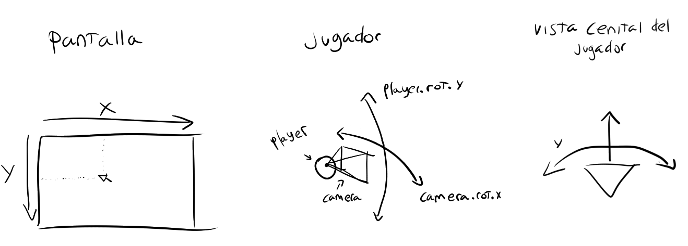

# Ejercicio teórico-práctico 2: Estudio del funcionamiento de una cámara FPS y salto

**Por: Arturo Cortés Sánchez**


#### Plantea a nivel teórico el movimiento de cámara con ratón en Godot, ayúdate de esquemas.




1. Capturar el ratón y guardar su posición en la pantalla.
2. Fijar la rotación en grados del jugador en el eje Y a la coordenada X del ratón. Opcionalmente la coordenada X del ratón podrá ser multiplicada por un número para ajustar la sensibilidad y dirección del movimiento.
3. Fijar la rotación en grados de la cámara en el eje X a la coordenada Y del ratón. De igual forma que en el caso anterior, dicha coordenada podrá ser multiplicada por un numero. Además hay que limitar cuantos grados puede rotar la cámara para evitar "dar una voltareta". Limitarlos entre 90 y -90 suele ser lo habitual.
4. Trasladar al jugador. Al haber aplicado las operaciones de rotación en el eje Y al jugador, logramos que el jugador se mueva de forma relativa a la dirección a la que mira. 


#### Escribe en pseudocódigo como se implementaría una tecla de salto sin utilizar un motor de física (en base simplemente a  transformaciones de traslación), para ello estudia el [movimiento de tiro parabólico](https://en.wikipedia.org/wiki/Projectile_motion)

```go
extends Spatial

const GRAVEDAD := 9.8
const ANGULO := deg2rad(80)
const VELOCIDAD := 2.0
var t := 0.0

func _process(delta : float):
	if Input.is_action_pressed("ui_left"):
		rotate_y(delta)
	if Input.is_action_pressed("ui_right"):
		rotate_y(-delta)
	if Input.is_action_pressed("ui_accept") or translation.y !=0:
		t += delta
		var x := VELOCIDAD * t * cos(ANGULO)
		var y := VELOCIDAD * t * sin(ANGULO) - 0.5 * GRAVEDAD * t * t
		translate(Vector3(x, y, 0))
	if translation.y < 0:
		translation.y = 0.0
		t = 0.0

```


